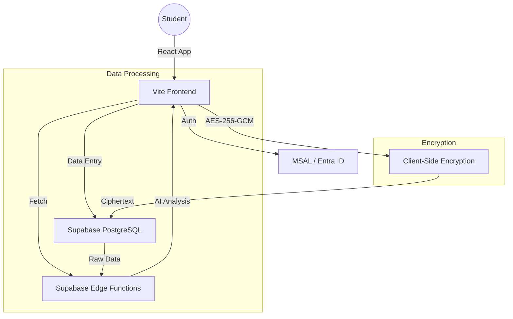

# Master Data Flow & Architecture

This document visualizes how data moves through the Student Wellness App from a user perspective.

## 1. System Architecture

## 2. User Case Flow (Daily Check-In)

1.  **Authentication**: Student logs in via NSCC Entra ID (handled by MSAL).
2.  **Home View**: The app fetches the last 30 days of `checkins` to calculate the 7-day rolling "Overall Index".
3.  **Journal Entry**: Student inputs reflections. 
    - *Processing*: The text is encrypted using a local key/IV before being sent to the server.
4.  **Pillar Scaling**: Student adjusts sliders (0-10) for the 4 Pillars.
5.  **Submission**: Data is saved to the `checkins` table in Supabase.
6.  **Insights**: The app invokes the `wellness-insights` Edge Function, which analyzes the metrics and provides a tailored self-care tip.

## 3. Resource Discovery Flow

1.  **Navigate**: User goes to "Support" page.
2.  **Campus Selection**: User selects a campus (e.g., Ivany).
3.  **Lookup**: App invokes `campus-resources` Edge Function.
4.  **Display**: Tailored local office locations and contact details are displayed derived from the campus ID.

## 4. Progressive Web App (PWA) Layer
- **offline**: Service worker caches core assets (`assets/`, `index.html`) using Workbox.
- **Install**: Manifest provides branding and icon assets for Android/iOS home screen installation.
