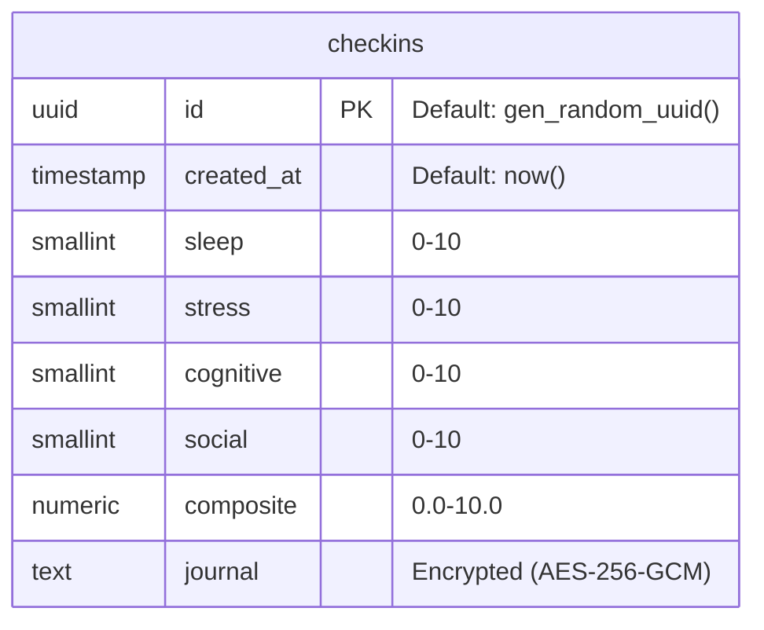

# Master ERD & Data Dictionary

This document specifies the database schema and data constraints for the Student Wellness App.

## 1. Entity Relationship Diagram (ERD)



## 2. Data Dictionary

| Column | Data Type | Constraints | Description |
|--------|-----------|-------------|-------------|
| `id` | `uuid` | PRIMARY KEY | Unique identifier for the check-in. |
| `created_at` | `timestamptz` | NOT NULL | Date and time (UTC) of submission. |
| `sleep` | `smallint` | 0 <= x <= 10 | User-reported quality of sleep. |
| `stress` | `smallint` | 0 <= x <= 10 | User-reported balance of stress. |
| `cognitive` | `smallint` | 0 <= x <= 10 | User-reported mental energy/clarity. |
| `social` | `smallint` | 0 <= x <= 10 | User-reported sense of belonging. |
| `composite` | `numeric(3,1)` | 0.0 <= x <= 10.0 | Calculated average of the 4 pillars. |
| `journal` | `text` | NULLABLE | Student's private reflection (Encrypted). |

## 3. SQL Definition

```sql
-- Create the core checkins table
create table checkins (
  id uuid default gen_random_uuid() primary key,
  created_at timestamp with time zone default timezone('utc'::text, now()) not null,
  
  -- The 4 Pillars (Values 0-10)
  sleep smallint not null check (sleep >= 0 and sleep <= 10),
  stress smallint not null check (stress >= 0 and stress <= 10),
  cognitive smallint not null check (cognitive >= 0 and cognitive <= 10),
  social smallint not null check (social >= 0 and social <= 10),
  
  -- The calculated composite score (0.0 to 10.0)
  composite numeric(3,1) not null check (composite >= 0.0 and composite <= 10.0),
  
  -- Encrypted journal
  journal text
);

-- Enable Row Level Security (RLS)
alter table checkins enable row level security;
```

## 4. Security Policies (RLS)

Currently, the app uses anonymous access for Phase 2 prototyping. Future teams must implement:
- **`user_id`** column (linked to MSAL).
- **RLS Policy**: `create policy "Users can see only their own data" on checkins for select using (auth.uid() = user_id);`
